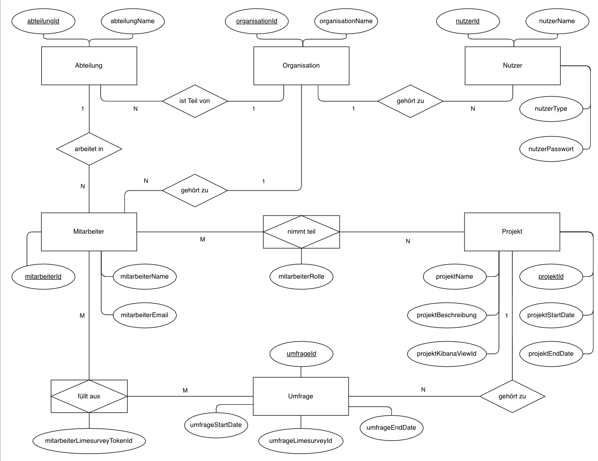

<!-- Headers-->

 
    
A&K-Bachelorprojekt:

    
Umfrage-System

    
Universität Potsdam

    
Wintersemester 2022/23

 
 

This gitup-repository contains the source code of the akcore frontend app and backend api developed as part of the the A&K-Project of ${PARTICIPANTS} at the University of Potsdam in the winter semester of 2022/2023.

# Frontend
### Prerequisites
npm, version > 9.2.0  
node, version > 19.3.0  
### Build instructions for the development environment
The frontend is developed with the Vue.js frontend web-framework. To run the Vue development server, while in the directory "/akcoreapp/", run  

`npm install`  
`npm run serve` 

This will run a development server listening at port 8081.

### Build instructions for the production environment
In a production environment, the vue app is deployed to a static web server, such as apache2, to be served over http. This can be done by running the command `npm run build`, which will create a "dist" directory at /var/www/html/akcore/dist/, containing a single page application ready to be deployed. The webserver needs to be properly setup to be able to serve the site correctly. (How to setup: TBD)

## 1. Allgemeines
### 1.1 Frameworks und Dependencies
<ul>
<li>Die Website wurde mit dem Vue.js Frontend Framework gebaut</li>
<li>das CSS-Styling wurde mit dem Bootstrap Framework realisiert</li>
<li>für http-requests wurde das AXIOS Framework genutzt</li>
</ul>

### 1.2 Aufbau der Website
<ul>
<li>die Navigationbar und die RouterView wurden in App.js eingebaut, der main file des Vue-Frameworks</li>
<li>Die Ansichten wie der Login-Screen, die Mitarbeiter-Ansicht und Projekt-Ansicht wurden über das Vue-RouterView Konzept als Views in die main file App.js eingebunden; klickt man auf einen Nav-Link, um beispielsweise zur Mitarbeiter-View zu gelangen, wird die aktuelle RouterView durch die MitarbeiterView ersetzt</li>
<li>häufig wiederverwendeter Code wurde als Component in die Views integriert, wie zum Beispiel der Loading-Anzeiger, um Code-Redundanz zu minimieren</li>
</ul>

### 1.3 Kommunikation mit dem Backend
<ul>
<li>müssen einzelne Views mit dem Backend kommunizieren, tun sie das über Funktionen, die die app.js Datei bereitstellt. Hierzu wird die api.js file in jede View imporiert. Es werden alle nötigen Daten an diese Funktionen weitergegeben</li>
<li>die Funktionen der api starten dann die http requests über axios (einer http request library für nodejs), indem sie die korrekten API-URIS aufrufen und im request body die daten aus den views an das backend übergeben</li>
</ul>

## 2 Funktionen
### 2.1 Einloggen
<ul>
<li>über einen Login-Screen, der angezeigt wird, wenn ein Nutzer nicht eingeloggt ist, kann sich ein Nutzer anmelden</li>
<li>dem Backend werden Nutzername und Passwort übergeben</li>
<li>das Backend übergibt bei Erfolg alle Daten des Accounts, unter anderem den Account-Typ, der festlegt, welche Funktionen einem Nutzer im Frontend angezeigt werden und die organisationId, die dem Backend bei jeder Operation übergeben wird</li>
<li>in Zukunft kann Authentifizierung durch eine JWT-Session-Token Authentifizierung ersetzt werden, aber für das PoC reicht diese Funktionalität vollkommen aus</li>
</ul>

### 2.2 Mitarbeiter und Abteilungen
<ul>
<li>ermöglicht Anlegen und Bearbeiten von Mitarbeitern und Abteilungen</li>
<li>Mitarbeiter werden für eine bestimmte Abteilung erstellt; sie können nicht abteilungslos sein</li>
<li>Mitarbeiter benötigen die Attribute Name und E-Mail und Abteilung</li>
<li>Abteilungen benötigen einen Namen</li>
<li>Mitarbeiter und Abteilungen existieren nach dem Erstellen in der Datenbank</li>
<li>Mitarbeiterattribute können aktualisiert werden</li>
<li>Abteilungen können nur gelöscht werden, falls die Abteilung leer ist</li>
<li><strike>Mitarbeiter können nur gelöscht werden, wenn sie gerade an keinem aktiven Projekt teilnehmen. Wird trotzdem der Versuch unternommen, wird eine Warnmeldung ausgegeben, und bei Bestätigung der Mitarbeiter rekursiv aus allen Projekten gelöscht.</strike><bold> Achtung!</bold> Noch nicht umgesetzt.</li>
<li>- es findet (noch) keine Frontend-Validierung statt</li>
</ul>

### 2.3 Projekte
#### 2.3.1 Anlegen
<ul>
<li>ermöglicht Anlegen und Bearbeiten von Projekten und Umfragen für ein Projekt</li>
<li>Projekte benötigen einen Namen, eine Beschreibung, ein Start- und End-Datum</li>
<li>es können beliebig viele Umfragen hinzugefügt werden; Umfragen benötigen ein Start- und End-Datum, das Startdatum darf nicht in der Vergangenheit und das Enddatum nicht vor dem Startdatum liegen</li>
<li>es können bereits existierende Teilnehmer ausgewählt werden; ihnen muss eine der 3 Mitarbeiter Rollen Key-User, Change-Manager, User zugeordnet werden (evtl. bearbeiten dieser Rollen ermöglichen?)</li>
<li>es werden alle Eingaben im Frontend validiert</li>
<li>dem Backend werden die vom User eingegebenen Projekt-Informationen sowie der organisationId des Users übergeben</li>
<li>das Backend übergibt nach dem Erfolg durch den Location-Header die projektId des erstellten Projekts und das Frontend leitet den User zur Projektansicht des erstellten Projekts</li>
</ul>

#### 2.3.2 Ansehen
<ul>
<li>ermöglicht das Darstellen eines Projekts</li>
<li>hier können alle Informationen, Umfragen und Teilnehmer eingesehen werden</li>
<li>über einen Button kann die Bearbeitungsansicht aufgerufen werden</li>
<li>über einen Button kann das dem Projekt zugeordnete Kibana-Dashboard angezeigt werden</li>
</ul>

#### 2.3.3 Bearbeiten
<ul>
<li>ermöglicht das Bearbeiten eines Projekts</li>
<li>es können Umfragen und Teilnehmer hinzugefügt werden</li>
<li>es können (noch) keine Umfragen und Teilnehmer gelöscht werden</li>
<li>über einen Button kann das Projekt gelöscht werden (evtl. verschieben dieser Funktionalität in Bearbeiten-Ansicht?)</li>
<li>dem Backend werden die Projekt-Informationen sowie die organisationId des Users übergeben; die Projekt-Informationen enthalten die alten sowie die neuen Projektinformationen gleichermaßen</li>
<li>das Backend übergibt eine Erfolgsmeldung nach Erfolg und das Frontend leitet zur Projektansicht weiter</li>
</ul>

# Backend
### Prerequisites
npm, version > 9.2.0  
node, version > 19.3.0  
### Build instructions for the development environment
The backend is developed with express.js for node. To run the express.js api server, while in the directory "/akcoreapi/", run  

`npm install`  
`npm run serve` 

This will run a exprees.js api server listening at port 3001.

### Build instructions for the production environment
In a production environment, the node app is run as a daemon (system service) on a Linux system. This will automatically restart the server if it crashes and logs any stdin/stderr output to a specified log-file. This project is setup through a systemd-daemon called "nodeapi", logging stdin/stderr via rsyslog to /akcoreapi/logs/service.log. To follow the content of the log live in a terminal, while the service is active, you can run `less -f /home/nifranz/dev/git/akcore_stable/logs/error.log`. To start or stop the service, you can run with appropriate privileges `systemctl [start | stop | restart] nodeapi`. 

## 1. Allgemeines
### 1.1 Frameworks, Packages und Dependencies
<ul>
<li>Der HTTP-API-Server wurde mit dem node.js-Framework express.js gebaut</li>
<li>Es wurde das ORM-Package Sequelize genutzt, um alle persistenten Daten zu modellieren und Datenbankfuntionen umzusetzen</li>
<li>Die Daten werden in einer mariadb Datenbank des Linux-Servers gespeichert</li>
<li>Um die Elasticsearch-API anzusprechen, wurde der elastic-search client für node.js genutzt</li>
<li>Es wurde das uuid-Package genutzt, um uuids generieren zu können</li>
</ul>

### 1.2 Struktur des Webservers
#### 1.2.1 API-Endpoints und Routing
<ul>
<li>Der Server bietet mehrere API-Endpoints an, um Backend-Funktionalitäten bereitzustellen</li>
<li>Einige dieser Endpoints sind über die express.js router-Funktionalität eingebunden, andere werden direkt (z.b mit app.get()) definiert</li>
<li>Die routes wurden in src/routes/ definiert und im router der app in server.js-file eingebunden.</li>
<li>Routes leiten die Anfrage an die Controller weiter, welche dann die Durchführung der angefragten Funktionen steuern</li>
</ul>

#### 1.2.2 Controller
<ul>
<li>Die Funktionalitäten der API-Endpoints werden durch Controller gesteuert, welche in src/controller/ definiert sind</li>
<li>Für jedes Data-Model (und damit alle Datenbankoperationen) existiert ein Controller</li>
<li>Zur Zeit existieren nur für Datenbankoperationen Controller, alle anderen Funktionalitäten werden noch in der server.js-file gesteuert und umgesetzt</li>
<li>Zur Zeit findet die Durchführung der Business-Logic (wie zum Beispiel das Erstellen eines Projekts) ebenfalls im Controller statt. In Zukunft können und sollte die Business-Logic von den Controllern in express-helper-services und -middlewares ausgelagert werden</li>
</ul>

#### 1.2.3 Datenbank und Sequelize Object-Relational-Mapper (ORM)
<ul>
<li>Die Daten werden in der mariadb Datenbank des Linux-Servers gespeichert. Hierfür existiert die Database "akcoredb" in mariadb</li>
<li>Die Verbindung zur Datenbank wird über Sequelize hergestellt</li>
<li>Die Datenmodellierung und Datenbankoperationen werden über Sequelize realisiert. Das generieren der Entity-Ids (bspw. die mitarbeiterId oder projektId) übernimmt Sequelize automatisch</li>
<li>Die Sequelize Entity-Models und ihre Relationen wurden in src/models/ definiert</li>
<li>Soll eine Datenbankoperation durchgeführt werden, werden enstprechende Methoden der Sequelize-Models ausgeführt (z. B. erstellt die Methode MitarbeiterModel.create(mitarbeiterData) einen Mitarbeiter in der mariadb-Datenbank)</li>
<li>Die Struktur der Daten wird durch folgendes ERM illustriert:</li>
</ul>
 

 "ERM-Datenmodell"

#### 1.2.4 Externe APIS

## 2 Funtionen

### 2.1 DataModel-Operationen (Controller Funktionen)
Diese Auflistung der Controller-Funktionen der DataModels stellt lediglich eine Übersicht der Vorgehensweise des Systems bei der Durchführung der genannten Operationen dar. Eine ausführliche Deskription der Funktionsweise sowie weiterer Informationen wie Funktions-Parameter und -Rückgabewerte ergibt sich aus dem dokumentierten Code der einzelnen Controller in <code>src/controller/</code> sowie der DataModels selbst in <code>src/models/</code>.
#### 2.1.2 Abteilungen
Abteilungen können aufgelistet, erstellt und gelöscht werden

<code>Abteilung.list()</code> - <em>Auflisten</em>

<code>Abteilung.create()</code> - <em>Erstellen</em>
<ul>
<li>Durch die Controller-Funktion <code>Abteilung.create()</code> wird eine Abteilung mit dem Attribut Name in der Datenbank angelegt</li>
<li><strike>Sollte bereits eine Abteilung mit dem Namen für die aktuelle Organisation existieren, wird die Abteilung nicht erstellt</strike> <strong style="color: #ED4F32;">Achtung!</strong> Noch nicht umgesetzt!</li>
</ul>

<code>Mitarbeiter.delete()</code> - <em>Löschen</em>
<ul>
<li>Durch die Funktion <code>Mitarbeiter.delete()</code> kann ein Abteilung aus der Datenbank gelöscht werden</li>
<li>Wird eine Abteilung angefragt, die Mitarbeiter enthält, wird die Abteilung nicht gelöscht</li>
</ul>

#### 2.1.1 Mitarbeiter
Mitarbeiter können aufgelistet, erstellt, bearbeitet und gelöscht werden
<!-- <ul>
<li></li>
</ul> -->
<code>Mitarbeiter.list()</code> - <em>Auflisten</em>
<ul>
<li>Durch die Controller-Funktion <code>Mitarbeiter.list()</code> werden alle Mitarbeiter einer gegebenen Organisation aufgelistet</li>
</ul>

<code>Mitarbeiter.create()</code> - <em>Erstellen</em>
<ul>
<li>Durch die Controller-Funktion <code>Mitarbeiter.create()</code> wird ein Mitarbeiter mit den Attributen Name, E-Mail und Abteilung in der Datenbank angelegt</li>
</ul>

<code>Mitarbeiter.update()</code> - <em>Bearbeiten</em>
<ul>
<li>Durch die Controller-Funktion <code>Mitarbeiter.update()</code> können alle Mitarbeiterattribute eines Mitarbeiters in der Datenbank aktualisiert werden.</li>
<li><strike>Für jede Umfrage, an der der Mitarbeiter teilnimmt, werden die neuen Attribute über LRPC auch in der LimeSurvey-Datenbank aktualisiert</strike>     
<strong style="color: #ED4F32;"> Achtung!</strong> Da die LimesurveyRPC eine nicht gelöste Fehlermeldung zurückgibt, wenn ein Participant über die funktion set_participant_attributes geupdated wird, werden die Attribute zur Zeit nicht in Limesurvey aktualisiert</li>
</ul>

<code>Mitarbeiter.delete()</code> - <em>Löschen</em>
<ul>
<li>Durch die Controller-Funktion <code>Mitarbeiter.delete()</code> kann ein Mitarbeiter aus der Datenbank gelöscht werden.</li>
<li><strike>Die dem Mitarbeiter zugehörigen LimesurveyParticipantTokens werden daraufhin aus allen Surveys gelöscht.</strike> <strong style="color: #ED4F32;">Achtung!</strong> Noch nicht umgesetzt!</li>
</ul>

#### 2.1.3 Projekte
Projekte können aufgelistet, asugegeben, erstellt, überarbeitet und gelöscht werden

<code>Projekt.list()</code> - <em>Auflisten</em>
<ul>
<li>Durch die Controller-Funktion <code>Projekt.list()</code> werden alle Projekte und ihre Informationen für eine gegebene Organisation aufgelistet</li>
</ul>

<code>Projekt.create()</code> - <em>Erstellen</em>
<ul>
<li>Durch die Controller-Funktion <code>Projekt.create()</code> wird ein Projekt mit den Attributen Projektname, Projektbeschreibung sowie Start- und Enddatum in der Datenbank angelegt</li>
<li>Außerdem werden für alle übergebenen Umfragen-Datensätze Umfragen mit den Attributen Start- und Enddatum in der Datenbank angelegt und über die Assoziationsbeziehung mit dem Projekt verlinkt</li>
<li>Für jede Umfrage wird eine Survey in Limesurvey angelegt. Hierfür wird eine zuvor von LimeSurvey exportierte LimeSurvey-LSS-Datei ("assets/base_survey_2.lss") dupliziert und so angepasst, dass sie den Projekt- und Umfrageattributen entspricht. Anschließend wird sie durch das LRPC in LimeSurvey importiert. Die durch das LRPC zurückgegebene surveyId der importierten5 Survey wird unter dem Umfrage-Attribut "umfrageLimesurveyId" in der Datenbank hinterlegt</li>
<li>Für jeden Mitarbeiter wird die Projektteilnahme über die Assoziationsbeziehung in der Datenbank verlinkt</li>
<li>Für jeden Mitarbeiter wird für jede Umfrage durch LRPC ein Limesurvey-Participant erstellt. Der resultierende Token, der den Mitarbeiter als Participant eindeutig einer Survey zuweisbar macht, wird über die Assoziationsbeziehung in der Datenbank unter dem Attribut "mitarbeiterLimesurveyTokenId" hinterlegt</li>
<li>Für das Projekt werden in Elastic durch die Elastic API drei Indices angelegt: responses, count und pie. Um die Indices zu referenzieren, enthalten die Indices die projektId</li>
<li>Für das Projekt wird durch die Kibana API in Kibana ein Space angelegt; die id des Space' ist die projektId. Das Kibana source-Dashboard wird in den neuen Space hineinkopiert. Das DataView des kopierten Dashboards wird angepasst, sodass es nun die Elastic Indices des Projekts referenziert. Die Id des Dashboards wird im Projekt-Attribut "projektKibanaViewId" hinterlegt</li>
</ul>

<code>Projekt.read()</code> - <em>Ausgeben</em>
<ul>
<li>Durch die Controller-Funktion <code>Projekt.read()</code> wird ein Projekt und zugehörige Informationen ausgegeben</li>
</ul>

<code>Projekt.update()</code> - <em>Bearbeiten</em>
<ul>
<li>Durch die Controller-Funktion <code>Projekt.update()</code> können alle Projektattribute in der Datenbank aktualisiert werden.</li>
<li>Es können weitere Teilnehmer und Umfragen dem Projekt hinzugefügt werden. Umfragen werden in der Datenbank hinterlegt, Teilnehmer über die Assoziationsbeziehung dem Projekt in der Datenbank zugeordnet</li>
<li>Werden neue Teilnehmer hinzugefügt, werden für die neuen Teilnehmer Survey-Participants in allen dem Projekt zugehörigen Surveys durch LRPC nach dem selben Vorgehen wie in <code>Projekt.create()</code> angelegt</li>
<li>Werden Umfragen hinzugefügt, werden für sie neue Umfragen durch LRPC angelegt und für alle Teilnehmer des Projekts Survey-Participants angelegt (siehe <code>Projekt.create()</code>)</li>
<li><strike>Es können Umfragen aus einem Projekt entfernt werden. Werden Umfragen entfernt, wird die entsprechende Survey aus LimeSurvey und der Datenbank gelöscht.</strike> <strong style="color: #ED4F32;">Achtung!</strong> Noch nicht umgesetzt!</li>
<li><strike>Es können Teilnehmer aus einem Projekt entfernt werden. Dabei wird die Assoziationsbeziehung in der Datenbank zwischen Projekt und Mitarbeiter aufgehoben und alle Survey-Participants des Teilnehmers in den Surveys des Projekts gelöscht</strike> <strong style="color: #ED4F32;">Achtung!</strong> Noch nicht umgesetzt!</li>
</ul>
<code>Projekt.delete()</code> - <em>Löschen</em>
<ul>
<li>Durch die Controller-Funktion <code>Projekt.delete()</code> wird ein Projekt aus der Datenbank gelöscht, die Assoziationen von Teilnehmern und dem Projekt gelöscht sowie alle Surveys des Projekts durch LRPC in LimeSurvey gelöscht</li>
</ul>

### 2.2 Service-Integrationen

#### 2.2.1 LimeSurvey

#### 2.2.2 ElasticSearch

</ul>